# Enterprise Retail Lakehouse Pipeline

## Project Overview

This project demonstrates an end-to-end enterprise-style Retail Data Engineering pipeline built using Databricks and Apache Spark.

The solution follows the Medallion Architecture (Bronze, Silver, and Gold layers) and includes data ingestion, transformation, business aggregations, incremental processing, data quality validation, audit logging, and parameterized pipeline execution.

## Architecture

The solution follows a production-style Medallion Architecture with Bronze, Silver, and Gold layers, supported by incremental processing, data quality validation, audit logging, and parameterized orchestration.

## Technologies Used

- Databricks
- Apache Spark
- PySpark
- Spark SQL
- Delta Lake
- Unity Catalog
- Python
- Git
- GitHub

## Project Structure

| Notebook | Purpose |
|---|---|
| 01_Bronze_Data_Ingestion | Ingest raw retail data into the Bronze layer |
| 02_Silver_Data_Transformation | Clean and transform Bronze data |
| 03_Gold_Business_Aggregations | Create business-level Gold datasets |
| 04_Project_Validation | Validate pipeline outputs and data |
| 05_Incremental_Load | Demonstrate incremental data processing |
| 06_Audit_Error_Logging | Capture pipeline execution and error information |
| 07_Data_Quality_Framework | Perform reusable data quality checks |
| 08_Parameterized_Pipeline | Execute processing using configurable parameters |

## Data Flow

### Bronze Layer

Raw source files are ingested into the Bronze layer while preserving the original source data.

### Silver Layer

Bronze data is cleaned and transformed using PySpark.

Typical transformations include:

- Null handling
- Duplicate removal
- Data type conversion
- Standardization
- Data validation
- Derived columns

### Gold Layer

Business-ready datasets and aggregations are created for analytics and reporting.

Examples include:

- Sales analysis
- Customer analysis
- Product performance
- Revenue aggregations
- Business KPIs

## Advanced Data Engineering Features

This project also demonstrates:

- Incremental data loading
- Audit logging
- Error handling
- Data quality validation
- Parameterized pipelines
- Delta Lake processing
- Medallion architecture
- Reusable PySpark transformations

## Data Quality

The pipeline includes validation checks to identify invalid or incomplete records before they are used by downstream analytical workloads.

## Incremental Processing

Incremental load logic demonstrates how pipelines can process newly arrived data instead of reprocessing the complete dataset during every execution.

## Audit and Error Logging

Pipeline execution information and processing errors are captured to improve monitoring, troubleshooting, and operational reliability.

## Business Use Case

The pipeline converts raw retail datasets into clean and analytics-ready datasets that can support:

- Sales reporting
- Customer insights
- Product performance analysis
- Revenue analysis
- Management dashboards

## Repository Purpose

This repository is a portfolio project demonstrating practical Data Engineering concepts and Databricks Lakehouse implementation.

It is designed to showcase skills in PySpark, Spark SQL, Delta Lake, data quality, incremental processing, pipeline design, and Git-based development.

## Pipeline Execution Results

The following screenshots demonstrate the successful execution, validation, monitoring, and advanced processing capabilities of the Databricks Retail Lakehouse pipeline.

### Bronze Layer - Source Data Ingestion

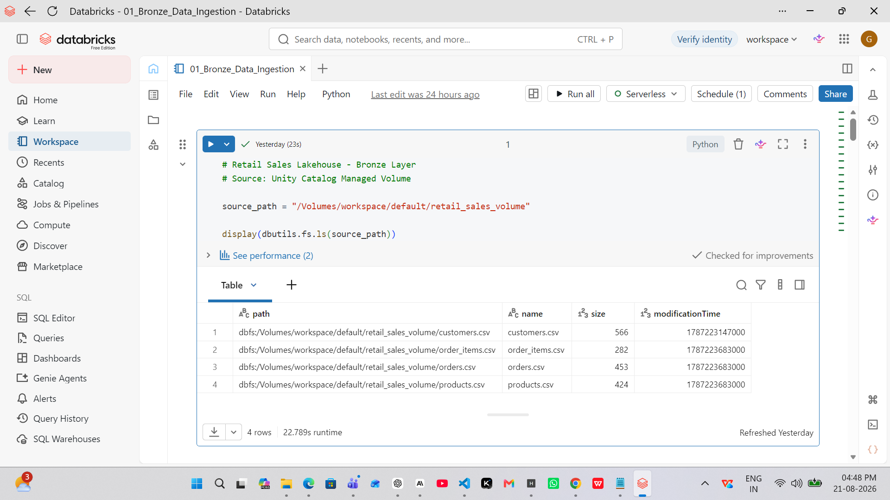

### Bronze Layer - Table Validation

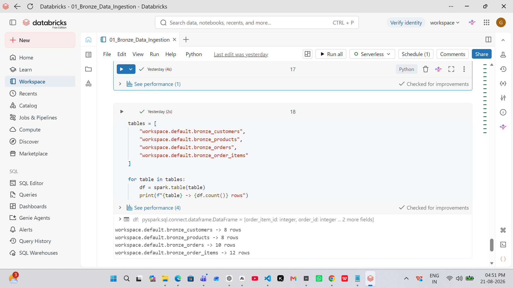

### Silver Layer - Customer Transformation

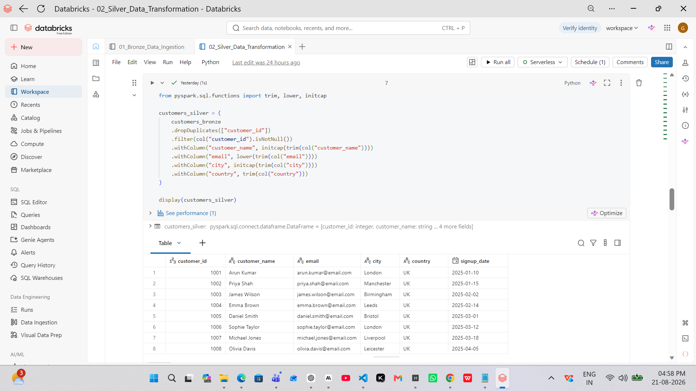

### Silver Layer - Table Validation

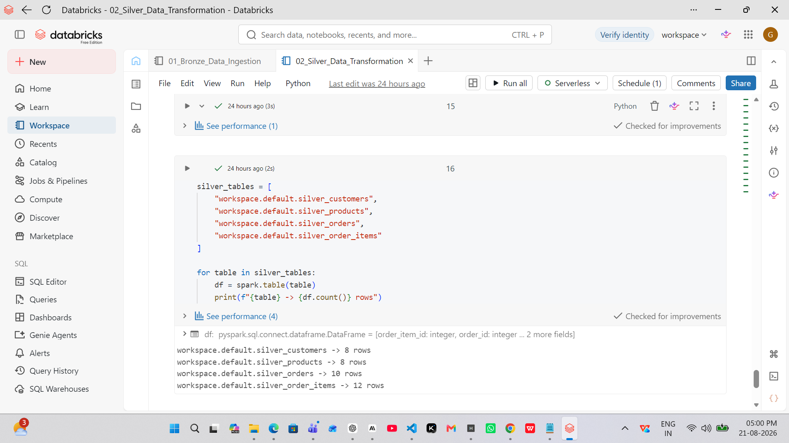

### Gold Layer - Fact Sales

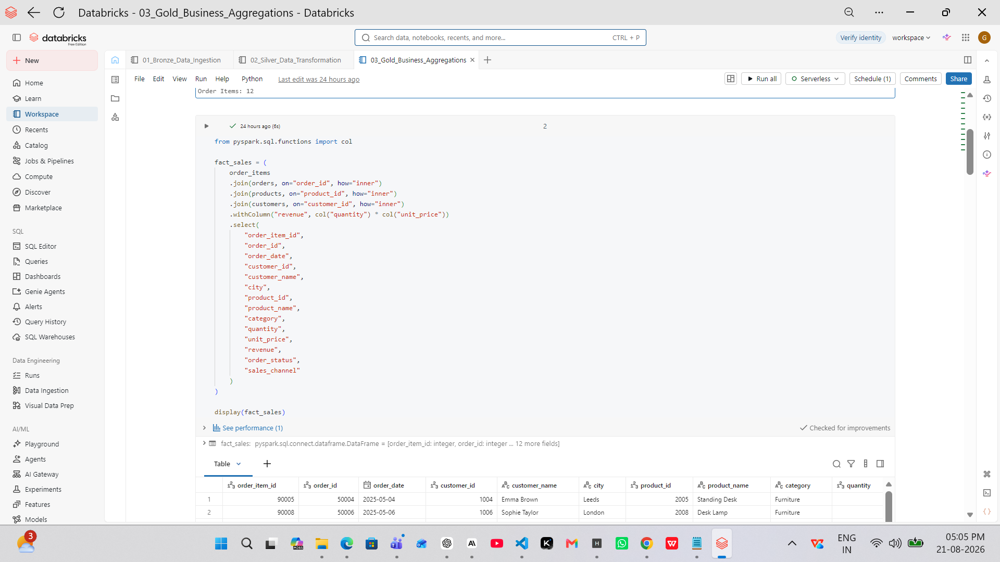

### Gold Layer - Table Validation

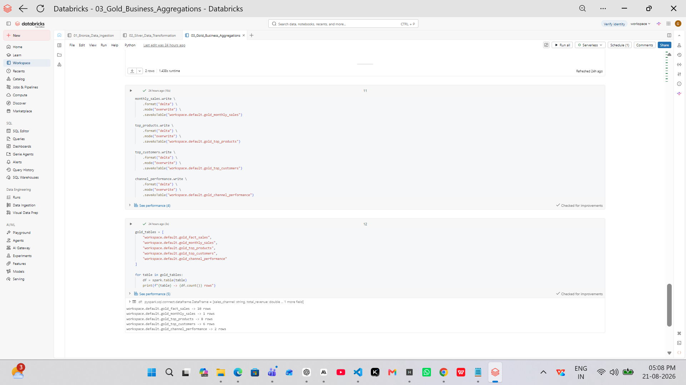

### Gold Layer - Business Aggregations

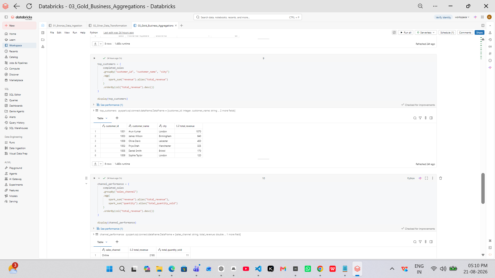

### Project Validation - Record Count Reconciliation

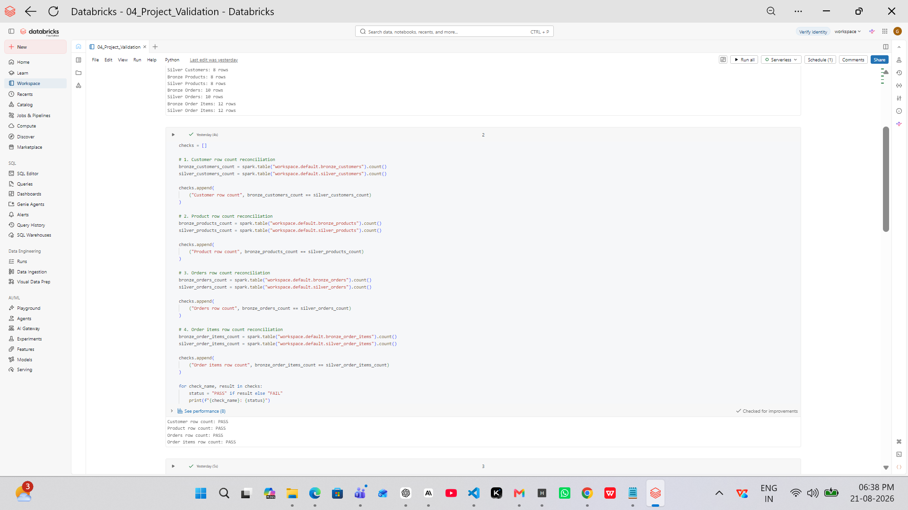

### Project Validation - Summary

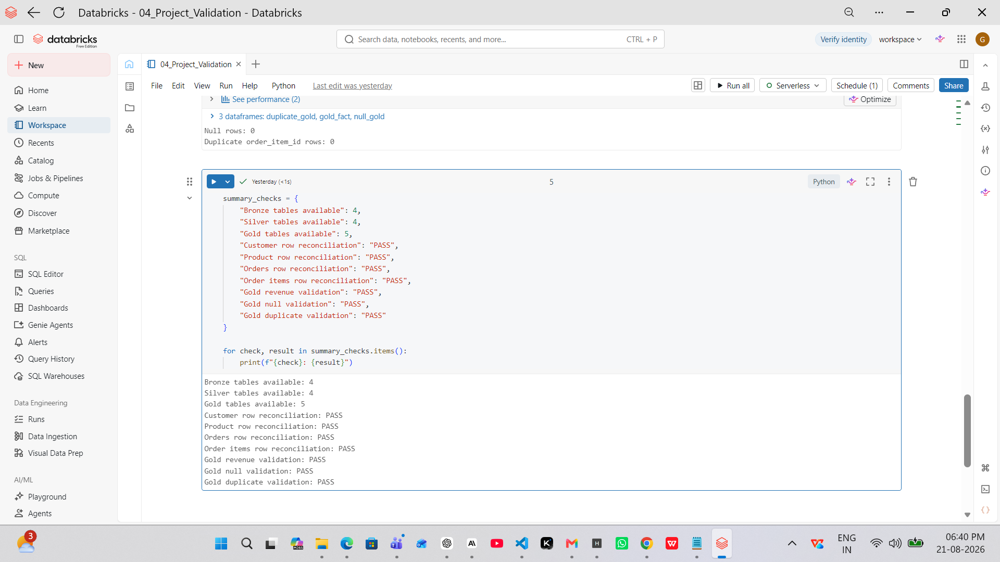

### Incremental Load using Delta MERGE

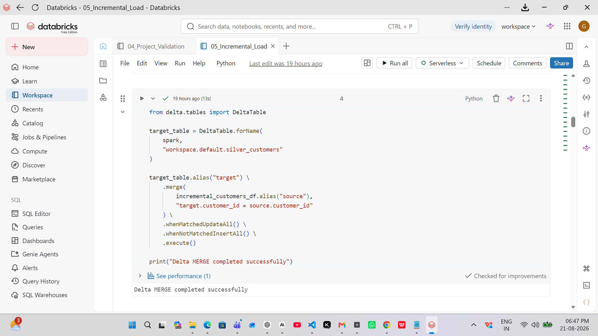

### Audit and Error Logging

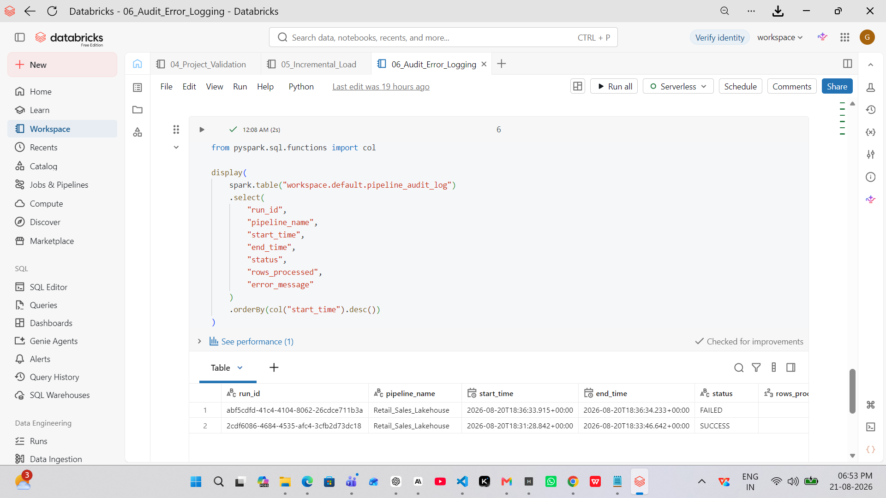

### Data Quality Framework

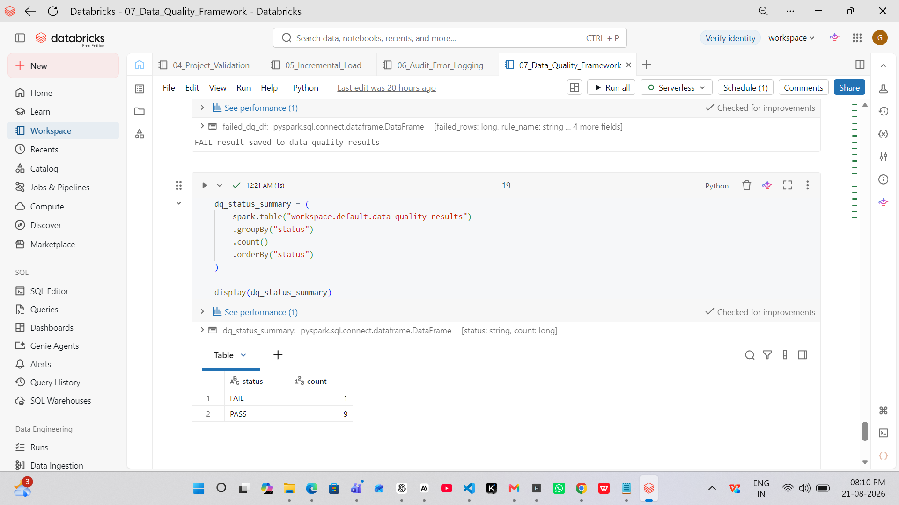

### Parameterized Pipeline

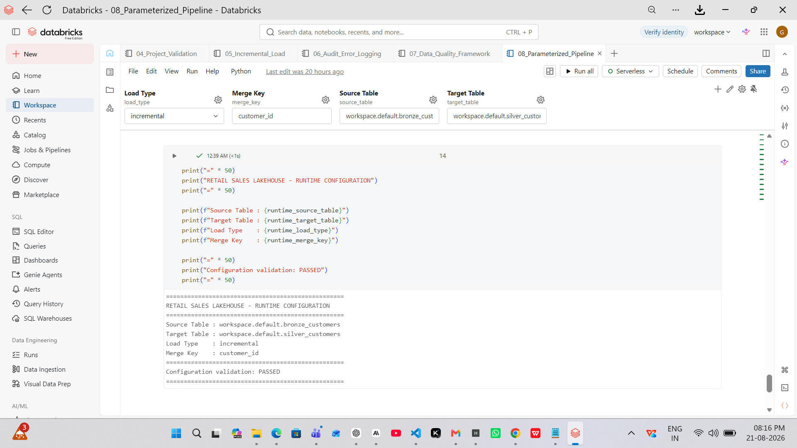-
